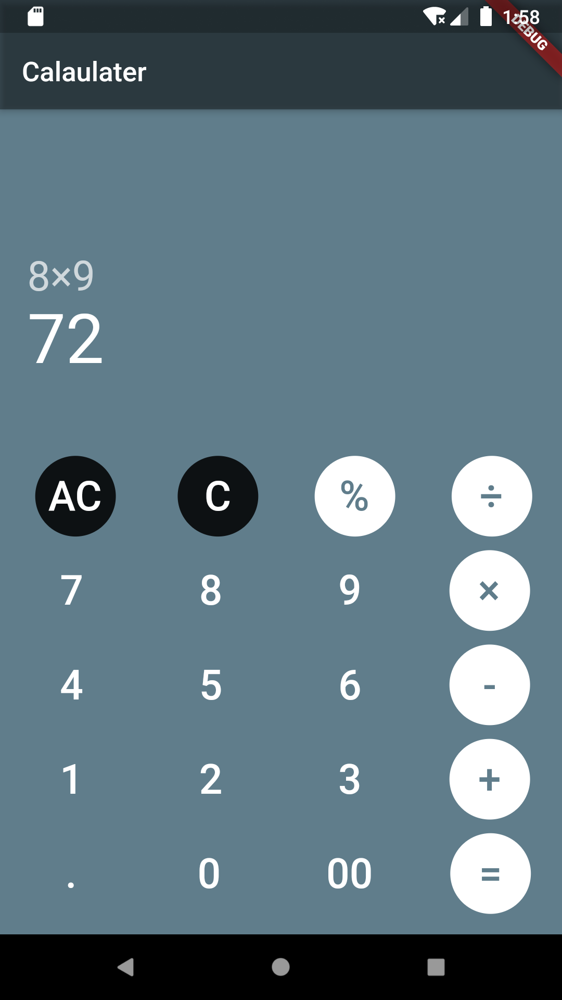
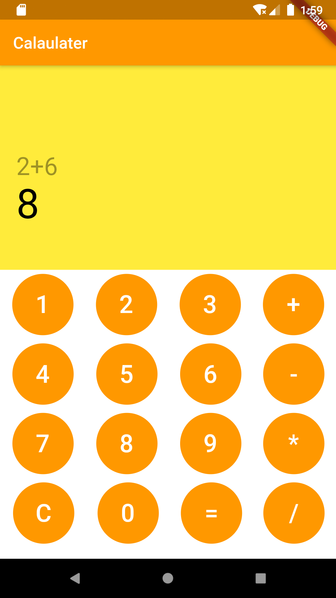

# Calaulater Flutter App :calculator:



## Description :memo:

Welcome to the Calculator Flutter App! This is a simple calculator app built using Flutter. It features two themes: black and orange. You can switch between the themes by modifying the home widget in the code.

### Black Theme:
   the default one

  
  

### Orange Theme:
  
  
  you can change it by changing home widget to OCalApp like this
```dart
class MyApp extends StatelessWidget {
  @override
  Widget build(BuildContext context) {
    return MaterialApp(
      title: 'Material App',
      home: OCalApp(),//OCalApp() to use orange one
    );
  }
}
```

## How to Use :rocket:

To get started with the Calaulater Flutter App, follow these steps:

1. Clone the repository to your local machine.

2. Open the project in your preferred Flutter development environment.

3. Run the app on an emulator or physical device.

4. Explore the calculator functionality and switch between the available themes.

## Resources :books:

If this is your first Flutter project or you need help getting started, check out these resources:

- [Lab: Write your first Flutter app](https://flutter.dev/docs/get-started/codelab)
- [Cookbook: Useful Flutter samples](https://flutter.dev/docs/cookbook)

For more detailed information about Flutter development, refer to the [online documentation](https://flutter.dev/docs) which includes tutorials, samples, guidance, and the full API reference.

## License :scroll:

This project is licensed under the MIT License. You are free to use, modify, and distribute the code for personal and commercial purposes.

## Support :sparkles:

If you encounter any issues or have suggestions for improvements, please feel free to open an issue on the repository. Your feedback is valuable in making this app even better!

## Stay Connected :iphone:

Connect with me on GitHub and stay up-to-date with my latest projects and repositories.

- [GitHub](https://github.com/SaraAlhaddadi)

Thank you for checking out the Calaulater Flutter App! Happy calculating! 💻:
